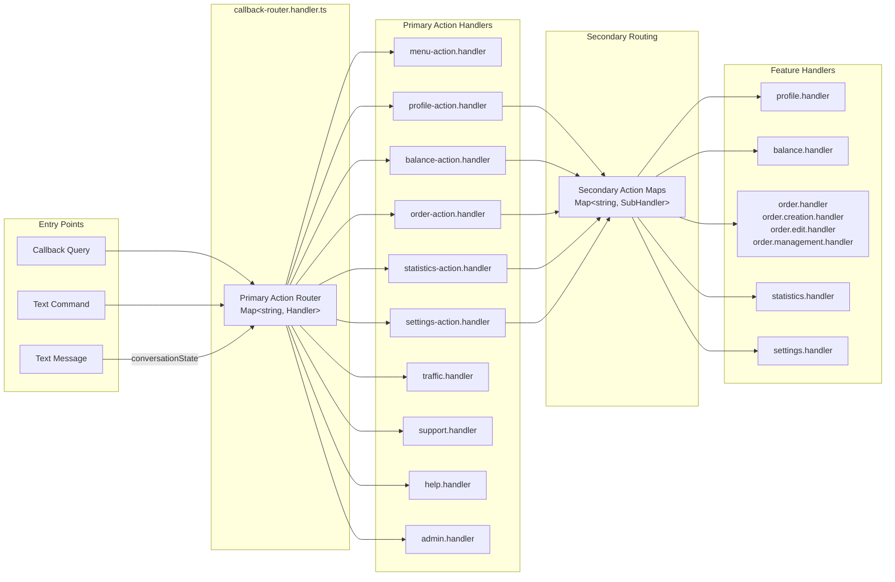
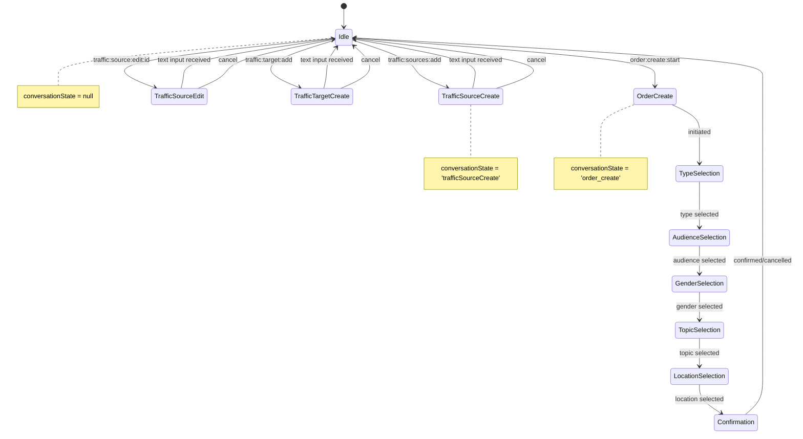
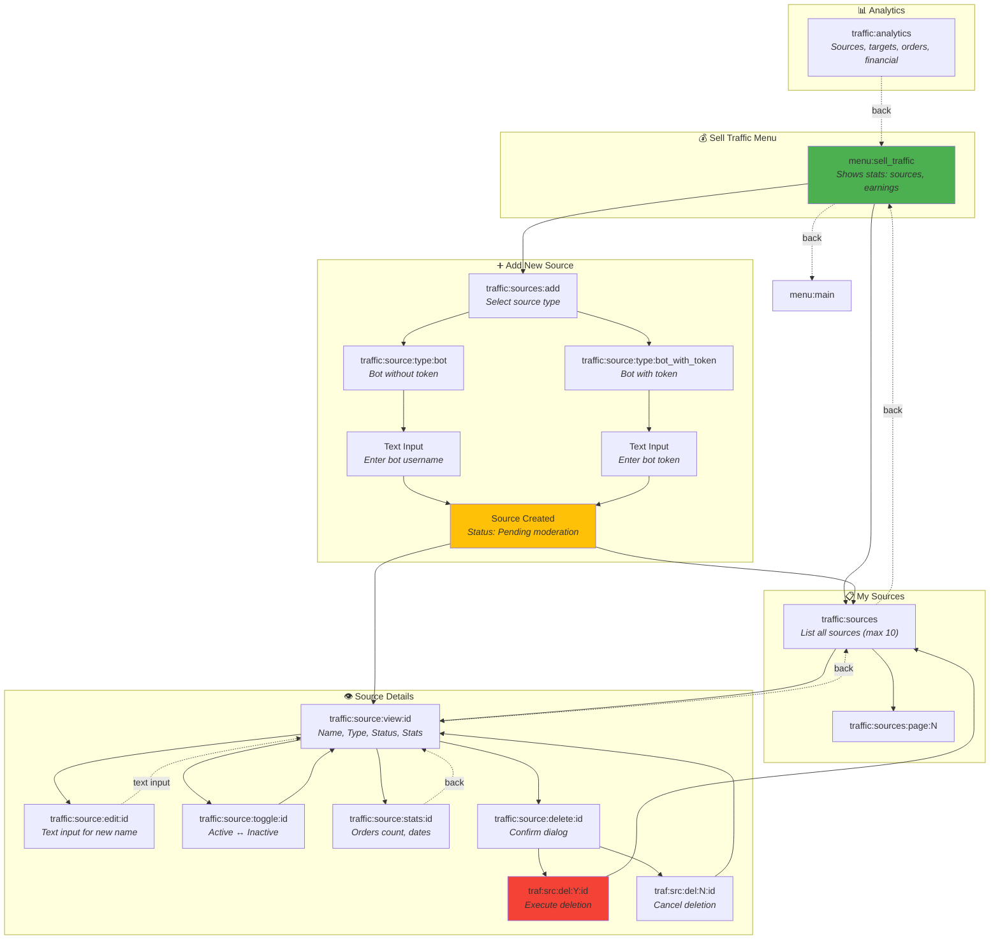
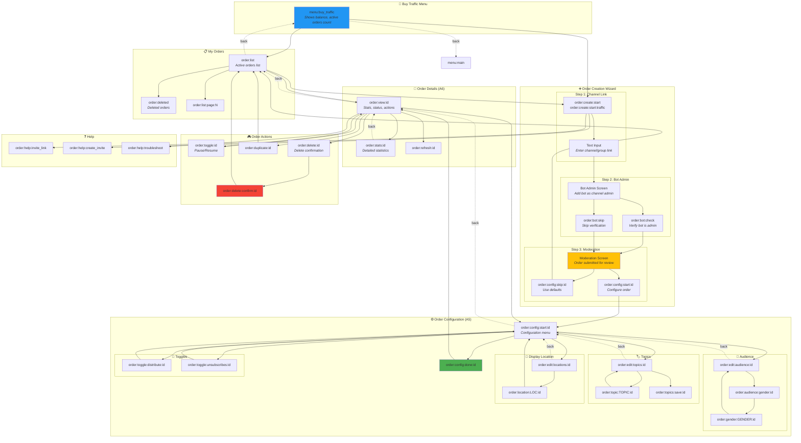

# Bot Menu Flow Graph

## Main Navigation Structure

```mermaid
flowchart TB
    subgraph Commands["Telegram Commands"]
        start["/start"]
        menu_cmd["/menu"]
        profile_cmd["/profile"]
        balance_cmd["/balance"]
        stats_cmd["/stats"]
        campaign_cmd["/campaign"]
        traffic_cmd["/traffic"]
        withdraw_cmd["/withdraw"]
        referral_cmd["/referral"]
        settings_cmd["/settings"]
        admin_cmd["/admin"]
        support_cmd["/support"]
        help_cmd["/help"]
        language_cmd["/language"]
    end

    subgraph MainMenu["Main Menu"]
        main["🏠 Main Menu<br/>menu:main"]
    end

    start --> main
    menu_cmd --> main

    subgraph SellTraffic["Sell Traffic Flow"]
        sell["💰 Sell Traffic<br/>menu:sell_traffic"]
        sources["📋 My Sources<br/>traffic:sources"]
        add_source["➕ Add Source<br/>traffic:sources:add"]
        source_view["👁 Source Details<br/>traffic:source:view:id"]
        source_edit["✏️ Edit Source<br/>traffic:source:edit:id"]
        source_delete["🗑 Delete Source<br/>traf:src:del:Y:id"]
        traffic_analytics["📊 Analytics<br/>traffic:analytics"]
    end

    subgraph BuyTraffic["Buy Traffic Flow"]
        buy["🛒 Buy Traffic<br/>menu:buy_traffic"]
        orders_list["📋 My Orders<br/>order:list"]
        order_create["➕ New Order<br/>order:create:start"]
    end

    subgraph OrderDetails["Order Management"]
        order_view["📄 Order Details<br/>order:details:id"]
        order_edit["✏️ Edit Order<br/>order:edit:id"]
        order_config["⚙️ Config<br/>order:config:id"]
        order_toggle["⏯ Toggle<br/>order:toggle:id"]
        order_delete["🗑 Delete<br/>order:delete:id"]
        order_stats["📊 Stats<br/>order:stats:id"]
        order_bot["🤖 Bot Management<br/>order:bot:id"]
    end

    subgraph OrderCreation["Order Creation Wizard"]
        type_select["📝 Type<br/>order:type:id:type"]
        audience_select["👥 Audience<br/>order:audience:*"]
        gender_select["⚧ Gender<br/>order:gender:*"]
        topic_select["🏷 Topic<br/>order:topic:*"]
        location_select["📍 Location<br/>order:location:*"]
        order_confirm["✅ Confirm<br/>order:confirm:id"]
    end

    subgraph Profile["Profile Section"]
        profile["👤 Profile<br/>profile:view"]
        profile_details["📋 Details<br/>profile:details"]
        profile_stats["📊 Stats<br/>profile:stats:*"]
    end

    subgraph Balance["Balance Section"]
        balance["💳 Balance<br/>balance:view"]
        balance_history["📜 History<br/>balance:history:page:N"]
        balance_withdraw["💸 Withdraw<br/>balance:withdraw"]
        balance_deposit["💵 Deposit<br/>balance:deposit"]
        balance_analytics["📊 Analytics<br/>balance:analytics"]
    end

    subgraph Withdrawal["Withdrawal Flow"]
        withdraw_currency["💱 Select Currency<br/>withdraw:currency:id"]
        withdraw_amount["💰 Enter Amount<br/>withdraw:amount:N"]
        withdraw_confirm["✅ Confirm<br/>withdraw:confirm:*"]
    end

    subgraph Deposit["Deposit Flow"]
        deposit_currency["💱 Select Currency<br/>deposit:currency:code"]
        deposit_address["📍 Get Address<br/>deposit:address:*"]
    end

    subgraph Settings["Settings Section"]
        settings["⚙️ Settings<br/>settings:*"]
        lang_menu["🌐 Language<br/>settings:language"]
        lang_en["🇬🇧 English<br/>settings:language:en"]
        lang_ru["🇷🇺 Russian<br/>settings:language:ru"]
        notifications["🔔 Notifications<br/>settings:notifications"]
        notify_toggle["🔘 Toggle<br/>settings:notify:type:val"]
        preferences["📐 Preferences<br/>settings:preferences"]
        privacy["🔒 Privacy<br/>settings:privacy"]
    end

    subgraph Support["Support Section"]
        support["🆘 Support<br/>menu:support"]
        contact["📞 Contact<br/>support:contact"]
        faq["❓ FAQ<br/>help:faq"]
        report["🚨 Report<br/>support:report"]
        suggest["💡 Suggest<br/>support:suggest"]
    end

    subgraph Help["Help Topics"]
        help["📚 Help<br/>menu:help"]
        help_orders["📋 Orders Help<br/>help:createOrder"]
        help_topup["💵 Top-up Help<br/>help:topup"]
        help_withdraw["💸 Withdraw Help<br/>help:withdraw"]
        help_stats["📊 Stats Help<br/>help:stats"]
        help_traffic["🚦 Traffic Help<br/>help:traffic"]
    end

    subgraph Statistics["Statistics Section"]
        stats["📊 Statistics<br/>stats:overview"]
        stats_detailed["📈 Detailed<br/>stats:detailed"]
        stats_traffic["🚦 Traffic<br/>stats:traffic"]
        stats_earnings["💰 Earnings<br/>stats:earnings"]
    end

    subgraph Admin["Admin Panel"]
        admin["👑 Admin<br/>admin:*"]
    end

    subgraph Referral["Referral System"]
        referral["🔗 Referrals<br/>menu:referral"]
    end

    subgraph Campaign["Campaign Management"]
        campaign["📢 Campaigns<br/>menu:campaign"]
    end

    subgraph Moderation["Moderation (App Layer)"]
        mod_approve["✅ Approve<br/>moderation:approve:type:id"]
        mod_decline["❌ Decline<br/>moderation:decline:type:id"]
    end

    %% Main Menu Connections
    main --> sell
    main --> buy
    main --> profile
    main --> balance
    main --> settings
    main --> support
    main --> help
    main --> stats
    main --> referral
    main --> campaign
    main --> admin

    %% Command shortcuts
    profile_cmd --> profile
    balance_cmd --> balance
    stats_cmd --> stats
    campaign_cmd --> campaign
    traffic_cmd --> sell
    withdraw_cmd --> balance_withdraw
    referral_cmd --> referral
    settings_cmd --> settings
    admin_cmd --> admin
    support_cmd --> support
    help_cmd --> help
    language_cmd --> lang_menu

    %% Sell Traffic Flow
    sell --> sources
    sell --> add_source
    sell --> traffic_analytics
    sources --> source_view
    source_view --> source_edit
    source_view --> source_delete
    add_source -.->|text input| sources

    %% Buy Traffic Flow
    buy --> orders_list
    buy --> order_create
    orders_list --> order_view

    %% Order Details
    order_view --> order_edit
    order_view --> order_config
    order_view --> order_toggle
    order_view --> order_delete
    order_view --> order_stats
    order_view --> order_bot

    %% Order Creation
    order_create --> type_select
    type_select --> audience_select
    audience_select --> gender_select
    gender_select --> topic_select
    topic_select --> location_select
    location_select --> order_confirm
    order_confirm --> orders_list

    %% Profile
    profile --> profile_details
    profile --> profile_stats

    %% Balance
    balance --> balance_history
    balance --> balance_withdraw
    balance --> balance_deposit
    balance --> balance_analytics

    %% Withdrawal
    balance_withdraw --> withdraw_currency
    withdraw_currency --> withdraw_amount
    withdraw_amount --> withdraw_confirm

    %% Deposit
    balance_deposit --> deposit_currency
    deposit_currency --> deposit_address

    %% Settings
    settings --> lang_menu
    settings --> notifications
    settings --> preferences
    settings --> privacy
    lang_menu --> lang_en
    lang_menu --> lang_ru
    notifications --> notify_toggle

    %% Support
    support --> contact
    support --> faq
    support --> report
    support --> suggest

    %% Help
    help --> help_orders
    help --> help_topup
    help --> help_withdraw
    help --> help_stats
    help --> help_traffic

    %% Statistics
    stats --> stats_detailed
    stats --> stats_traffic
    stats --> stats_earnings

    %% Back navigation (dashed)
    sell -.->|back| main
    buy -.->|back| main
    profile -.->|back| main
    balance -.->|back| main
    settings -.->|back| main
    support -.->|back| main
    help -.->|back| main
    stats -.->|back| main
```



## Callback Router Architecture



## Session State Machine



## Handler File Structure

```
libs/feature/bot/main/src/handler/
├── callback-router.handler.ts      # Central routing hub
├── command.handler.ts              # /commands processing
├── menu-action.handler.ts          # Menu navigation
├── menu.handler.ts                 # Root menu display
│
├── admin/
│   └── admin.handler.ts            # Admin operations
│
├── balance/
│   ├── balance.handler.ts          # Balance operations
│   ├── balance-action.handler.ts   # Balance routing
│   └── balance.keyboards.ts        # Balance keyboards
│
├── help/
│   └── help.handler.ts             # Help topics
│
├── menu/
│   └── menu.handler.ts             # Submenu handlers
│
├── order/
│   ├── order.handler.ts            # Order display
│   ├── order-action.handler.ts     # Order routing
│   ├── order.creation.handler.ts   # Order wizard
│   ├── order.edit.handler.ts       # Order editing
│   ├── order.management.handler.ts # Order ops
│   ├── order.config.handler.ts     # Order config
│   └── order.keyboards.ts          # Order keyboards
│
├── profile/
│   ├── profile.handler.ts          # Profile display
│   ├── profile-action.handler.ts   # Profile routing
│   └── profile.keyboards.ts        # Profile keyboards
│
├── settings/
│   ├── settings.handler.ts         # Settings ops
│   ├── settings-action.handler.ts  # Settings routing
│   └── settings.keyboards.ts       # Settings keyboards
│
├── statistics/
│   ├── statistics.handler.ts       # Stats display
│   ├── statistics-action.handler.ts # Stats routing
│   └── statistics.keyboards.ts     # Stats keyboards
│
├── support/
│   └── support.handler.ts          # Support ops
│
└── traffic/
    └── traffic.handler.ts          # Traffic ops

apps/bot/src/handler/
└── moderation-callback.handler.ts  # Moderation (app layer)
```

## Callback Data Format

```
Format: primaryAction:secondaryAction:param1:param2:...

Examples:
┌──────────────────────────────────┬────────────────────────────────┐
│ Callback Data                    │ Description                    │
├──────────────────────────────────┼────────────────────────────────┤
│ menu:main                        │ Go to main menu                │
│ menu:sell_traffic                │ Go to sell traffic menu        │
│ menu:buy_traffic                 │ Go to buy traffic menu         │
├──────────────────────────────────┼────────────────────────────────┤
│ order:list                       │ Show orders list               │
│ order:active:page:2              │ Active orders, page 2          │
│ order:details:uuid               │ Order details                  │
│ order:create:start               │ Start order creation           │
│ order:edit:uuid:field:value      │ Edit order field               │
│ order:toggle:uuid                │ Pause/resume order             │
│ order:delete:uuid                │ Delete order                   │
│ order:confirm:uuid               │ Confirm order                  │
├──────────────────────────────────┼────────────────────────────────┤
│ balance:view                     │ Show balance                   │
│ balance:history:page:2           │ Transaction history            │
│ balance:withdraw                 │ Start withdrawal               │
│ balance:deposit                  │ Start deposit                  │
├──────────────────────────────────┼────────────────────────────────┤
│ traffic:sources                  │ List traffic sources           │
│ traffic:source:view:id           │ View source details            │
│ traf:src:del:Y:id                │ Confirm delete source          │
├──────────────────────────────────┼────────────────────────────────┤
│ settings:language:en             │ Change to English              │
│ settings:notifications           │ Notification settings          │
│ settings:notify:type:enabled     │ Toggle notification            │
├──────────────────────────────────┼────────────────────────────────┤
│ profile:view                     │ Show profile                   │
│ profile:details                  │ Profile details                │
│ profile:stats:activity           │ Activity statistics            │
├──────────────────────────────────┼────────────────────────────────┤
│ stats:overview                   │ Stats overview                 │
│ stats:detailed                   │ Detailed statistics            │
│ stats:traffic                    │ Traffic statistics             │
│ stats:earnings                   │ Earnings statistics            │
├──────────────────────────────────┼────────────────────────────────┤
│ moderation:approve:type:id       │ Approve moderation request     │
│ moderation:decline:type:id       │ Decline moderation request     │
├──────────────────────────────────┼────────────────────────────────┤
│ noop                             │ No operation (placeholder)     │
│ pagination:page:X                │ Pagination indicator           │
└──────────────────────────────────┴────────────────────────────────┘
```

## Detailed: Sell Traffic Flow



### Sell Traffic Callback Data

| Callback | Handler Method | Description |
|----------|---------------|-------------|
| `menu:sell_traffic` | `handleSellTrafficMenu` | Main sell traffic menu with stats |
| `traffic:sources` | `handleTrafficSourcesList` | List user's traffic sources |
| `traffic:sources:add` | `handleTrafficSourceAdd` | Start add source flow |
| `traffic:source:type:bot` | `handleTrafficSourceTypeSelect` | Select "Bot" type |
| `traffic:source:type:bot_with_token` | `handleTrafficSourceTypeSelect` | Select "Bot with Token" type |
| `traffic:source:view:id` | `handleTrafficSourceView` | View source details |
| `traffic:source:edit:id` | `handleTrafficSourceEdit` | Edit source name |
| `traffic:source:toggle:id` | `handleTrafficSourceToggle` | Toggle Active/Inactive |
| `traffic:source:stats:id` | `handleTrafficSourceStats` | View source statistics |
| `traffic:source:delete:id` | `handleTrafficSourceDelete` | Show delete confirmation |
| `traf:src:del:Y:id` | `handleTrafficSourceDeleteConfirm` | Confirm deletion |
| `traf:src:del:N:id` | `handleTrafficSourceView` | Cancel deletion |
| `traffic:analytics` | `handleTrafficAnalytics` | Show traffic analytics |

### Session States for Sell Traffic

| State | Form Data | Description |
|-------|-----------|-------------|
| `trafficSourceCreate` | `{ step: 'select_type' }` | Initial type selection |
| `trafficSourceCreate` | `{ step: 'enter_username', type: 'bot' }` | Waiting for bot username |
| `trafficSourceCreate` | `{ step: 'enter_token', type: 'bot_with_token' }` | Waiting for bot token |
| `trafficSourceEdit` | `{ sourceId, step: 'select_field' }` | Editing source name |

---

## Detailed: Buy Traffic Flow



### Buy Traffic / Order Callback Data

| Callback | Handler | Description |
|----------|---------|-------------|
| `menu:buy_traffic` | `handleBuyTrafficMenu` | Main buy traffic menu |
| **Order List** |
| `order:list` | `handleOrderList` | List active orders |
| `order:deleted` | `handleDeletedOrders` | List deleted orders |
| `order:list:page:N` | `handleOrderListPagination` | Paginated order list |
| **Order Creation** |
| `order:create:start` | `handleStartOrderCreation` | Start from orders list |
| `order:create:start:traffic` | `handleStartOrderCreation` | Start from buy traffic menu |
| `order:create:back` | `handleBack` | Cancel creation |
| `order:bot:check` | `handleBotAdminCheck` | Verify bot is channel admin |
| `order:bot:skip` | `handleBotAdminSkip` | Skip bot admin check |
| `order:config:skip:id` | `handleConfigSkip` | Use default config |
| **Order Configuration** |
| `order:config:start:id` | `handleOrderConfig` | Show config menu |
| `order:config:done:id` | `handleConfigDone` | Save and finish config |
| `order:edit:audience:id` | `handleEditAudience` | Edit audience settings |
| `order:audience:gender:id` | `handleAudienceGender` | Show gender selection |
| `order:gender:GENDER:id` | `handleGenderSelection` | Set gender filter |
| `order:edit:topics:id` | `handleEditTopics` | Edit excluded topics |
| `order:topic:TOPIC:id` | `handleTopicToggle` | Toggle topic exclusion |
| `order:topics:save:id` | `handleTopicsSave` | Save topics |
| `order:edit:locations:id` | `handleEditLocations` | Edit display locations |
| `order:location:LOC:id` | `handleLocationSelection` | Set display location |
| `order:toggle:distribute:id` | `handleToggleDistribute` | Toggle daily distribution |
| `order:toggle:unsubscribes:id` | `handleToggleUnsubscribes` | Toggle unsubscribe accounting |
| **Order Management** |
| `order:view:id` | `handleViewOrder` | View order details |
| `order:stats:id` | `handleOrderStats` | View order statistics |
| `order:refresh:id` | `handleRefreshStats` | Refresh statistics |
| `order:toggle:id` | `handleToggleOrder` | Pause/Resume order |
| `order:delete:id` | `handleDeleteOrder` | Show delete confirmation |
| `order:delete:confirm:id` | `handleDeleteConfirm` | Execute deletion |
| `order:duplicate:id` | `handleDuplicateOrder` | Duplicate order |
| **Help** |
| `order:help:invite_link` | `handleHelp` | Why invite link needed |
| `order:help:create_invite` | `handleHelp` | How to create invite link |
| `order:help:troubleshoot` | `handleHelp` | Troubleshooting |

### Order Creation Flow Steps

| Step | Enum Value | Description | Session State |
|------|------------|-------------|---------------|
| A2 | `EnterChannelLink` | User enters channel/group link | `order_create` |
| A3 | `AddBotAdmin` | Add bot as channel admin | `order_create` |
| A4 | `Moderation` | Order submitted for moderation | `order_create` |
| A5 | `Configuration` | Configure order settings | - |
| A6 | `ViewOrder` | View completed order | - |

### Order Configuration Options

| Category | Options | Callback Pattern |
|----------|---------|------------------|
| **Gender** | `any`, `male`, `female` | `order:gender:GENDER:id` |
| **Topics** | Multiple toggleable topics | `order:topic:TOPIC:id` |
| **Display Location** | Channel/Group specific locations | `order:location:LOC:id` |
| **Toggles** | Daily distribution, Unsubscribe accounting | `order:toggle:TYPE:id` |

---

## Key Statistics

| Metric                  | Count |
|-------------------------|-------|
| Handler Files           | 23    |
| Keyboard Files          | 5     |
| Primary Actions         | 17+   |
| Commands                | 19    |
| Menu Types              | 14    |
| Conversation States     | 5     |
