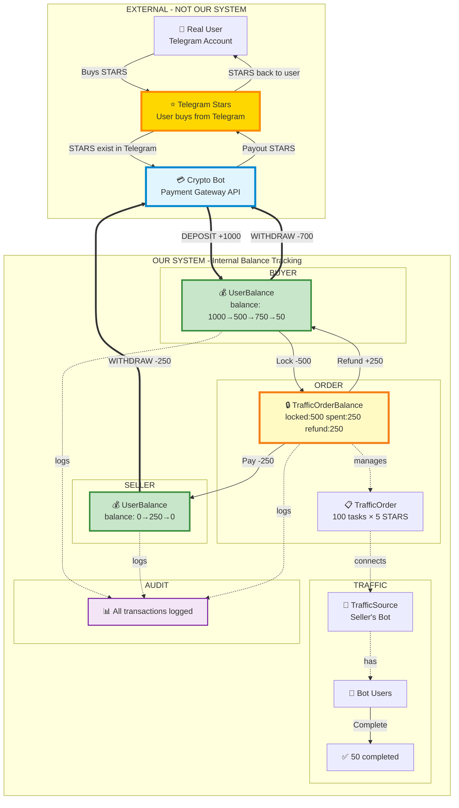

# Complete Money Flow - Single Diagram

## STARS are EXTERNAL - Flow from Telegram through Our System

## Critical Understanding

### STARS are EXTERNAL CURRENCY (like USD/EUR)
- **Owned by**: Telegram
- **Purchased from**: Telegram Stars API (user pays real money)
- **Managed by**: Crypto Bot payment gateway (handles deposits/withdrawals)

### Our System TRACKS Balances (like a bank)
- **UserBalance**: Internal ledger tracking how many STARS each user deposited
- **TrafficOrderBalance**: Internal ledger for locked funds per order
- **UserBalanceHistory**: Audit log of all balance changes
- **We don't create STARS** - we only track deposits/withdrawals via Crypto Bot API

## Flow Summary

| # | Layer | From | To | Amount | Description |
|---|-------|------|-----|--------|-------------|
| 0 | External | User | Telegram | Real $ | User buys STARS from Telegram |
| 1 | **Deposit** | Crypto Bot API | Our UserBalance | +1000 | Track deposit in our system |
| 2 | Internal | UserBalance | TrafficOrderBalance | -500 | Lock funds for order |
| 3 | Internal | TrafficOrderBalance | Seller UserBalance | -250 | Pay for 50 tasks |
| 4 | Internal | TrafficOrderBalance | Buyer UserBalance | +250 | Refund unused |
| 5 | **Withdraw** | Our UserBalance | Crypto Bot API | -700 | Process buyer withdrawal |
| 6 | **Withdraw** | Our UserBalance | Crypto Bot API | -250 | Process seller withdrawal |
| 7 | External | Crypto Bot | Telegram | STARS | Payout to user's Telegram |

## Balance Tracking Formula

**TrafficOrderBalance invariant**: `lockedAmount = spentAmount + availableAmount + refundedAmount`

**Example**: `500 = 250 + 0 + 250 ✅`
