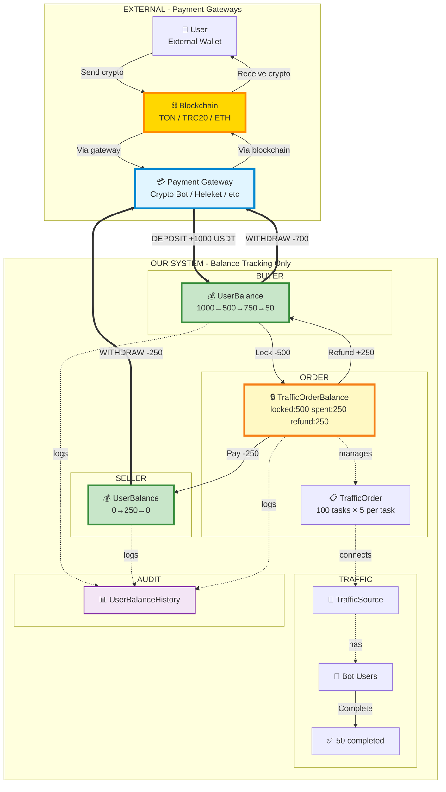

# Complete Money Flow - Single Diagram

## External Currency Flow Through Our System

## Critical Understanding

### Supported Currencies (EXTERNAL)
**Fiat**: USD, EUR, RUB
**Crypto**: USDT, TON, BTC, ETH, BNB, TRX, USDC, LTC, DOGE, DAI, DASH, BCH, SOL

### Our System = Ledger Only (like a bank)
- **UserBalance**: Tracks how much each user deposited
- **TrafficOrderBalance**: Tracks locked funds per order
- **UserBalanceHistory**: Audit log of all balance changes
- **We don't create/own crypto** - only track deposits/withdrawals via payment gateways

## Flow Summary

| # | Layer | From | To | Amount | Description |
|---|-------|------|-----|--------|-------------|
| 0 | External | User Wallet | Blockchain | 1000 USDT | User sends crypto |
| 1 | **Deposit** | Payment Gateway | Our UserBalance | +1000 | We track deposit |
| 2 | Internal | UserBalance | TrafficOrderBalance | -500 | Lock for order |
| 3 | Internal | TrafficOrderBalance | Seller UserBalance | -250 | Pay 50 tasks |
| 4 | Internal | TrafficOrderBalance | Buyer UserBalance | +250 | Refund unused |
| 5 | **Withdraw** | Our UserBalance | Payment Gateway | -700 | Buyer withdraws |
| 6 | **Withdraw** | Our UserBalance | Payment Gateway | -250 | Seller withdraws |
| 7 | External | Payment Gateway | Blockchain | 950 USDT | Process payouts |

## Formula

`lockedAmount = spentAmount + availableAmount + refundedAmount`

Example: `500 = 250 + 0 + 250 ✅`
