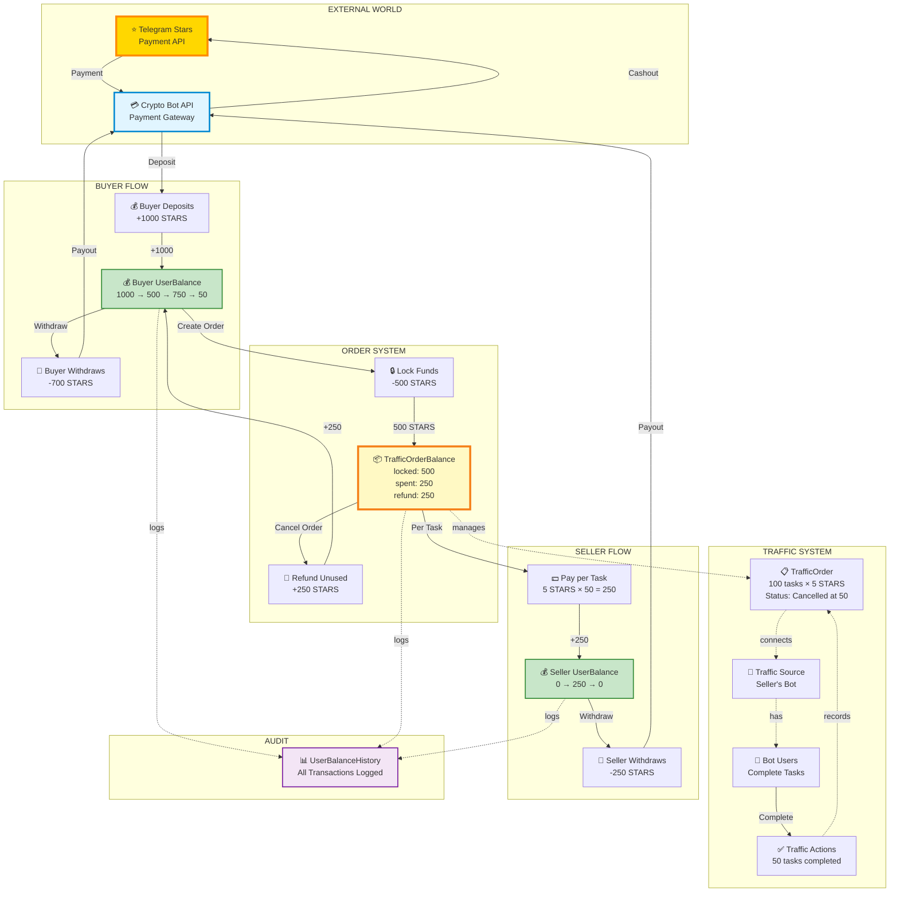

# Complete Money Flow - Single Diagram

## Full System Flow: STARS Origin → Deposit → Lock → Spend → Settle → Withdraw

## Flow Summary

| # | From | To | Amount | Description |
|---|------|-----|--------|-------------|
| 0 | Telegram Stars API | Crypto Bot | - | Payment gateway |
| 1 | Crypto Bot | Buyer UserBalance | +1000 | Deposit |
| 2 | Buyer UserBalance | TrafficOrderBalance | -500 | Lock funds for order |
| 3 | TrafficOrderBalance | Seller UserBalance | -250 | Pay for 50 completed tasks |
| 4 | TrafficOrderBalance | Buyer UserBalance | +250 | Refund unused (order cancelled) |
| 5 | Buyer UserBalance | Crypto Bot | -700 | Buyer withdraws |
| 6 | Seller UserBalance | Crypto Bot | -250 | Seller withdraws |
| 7 | Crypto Bot | Telegram Stars API | - | Process payouts |

## Balance Tracking

**Formula**: `lockedAmount = spentAmount + availableAmount + refundedAmount`

**Example**: `500 = 250 + 0 + 250 ✅`
