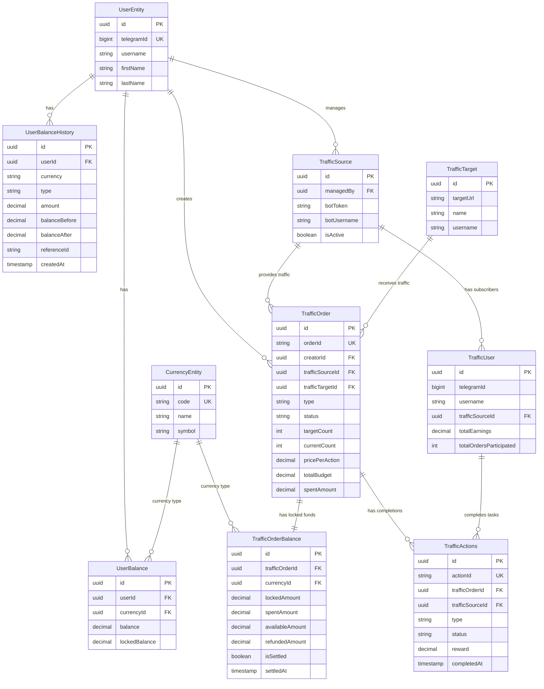
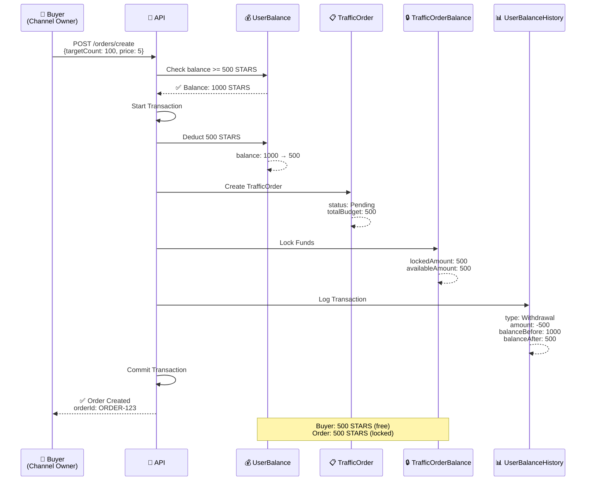
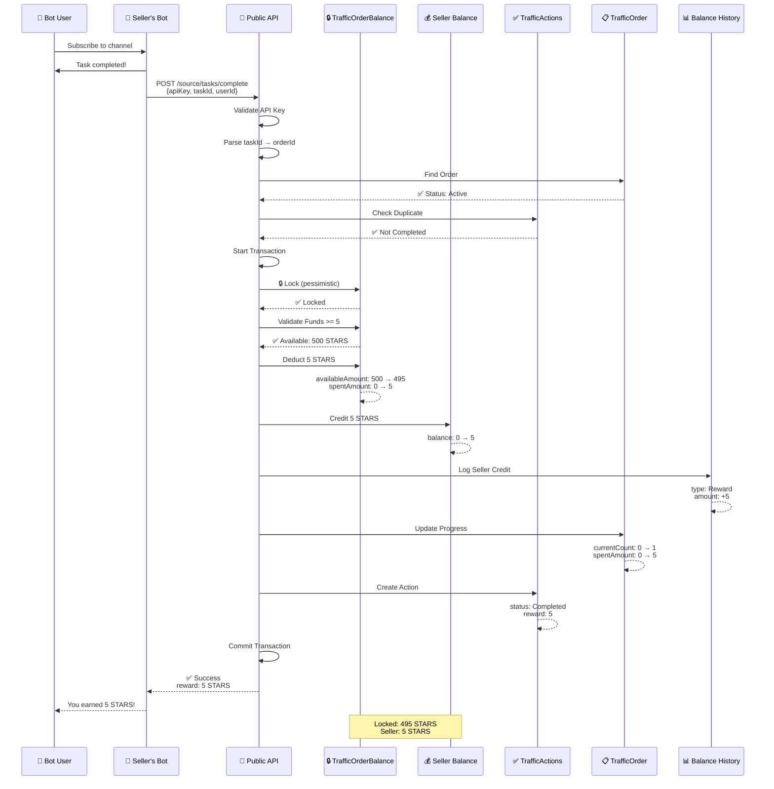
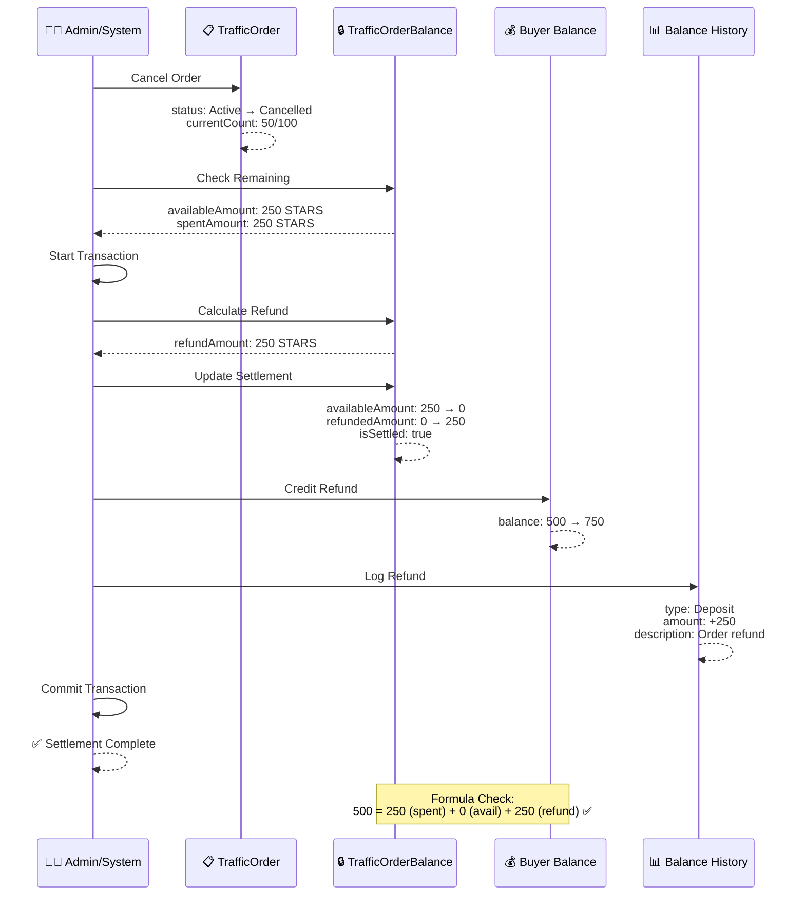
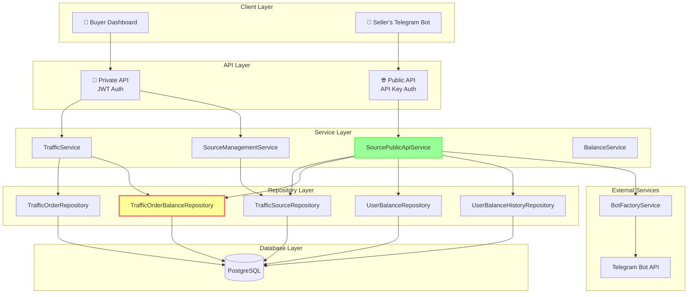
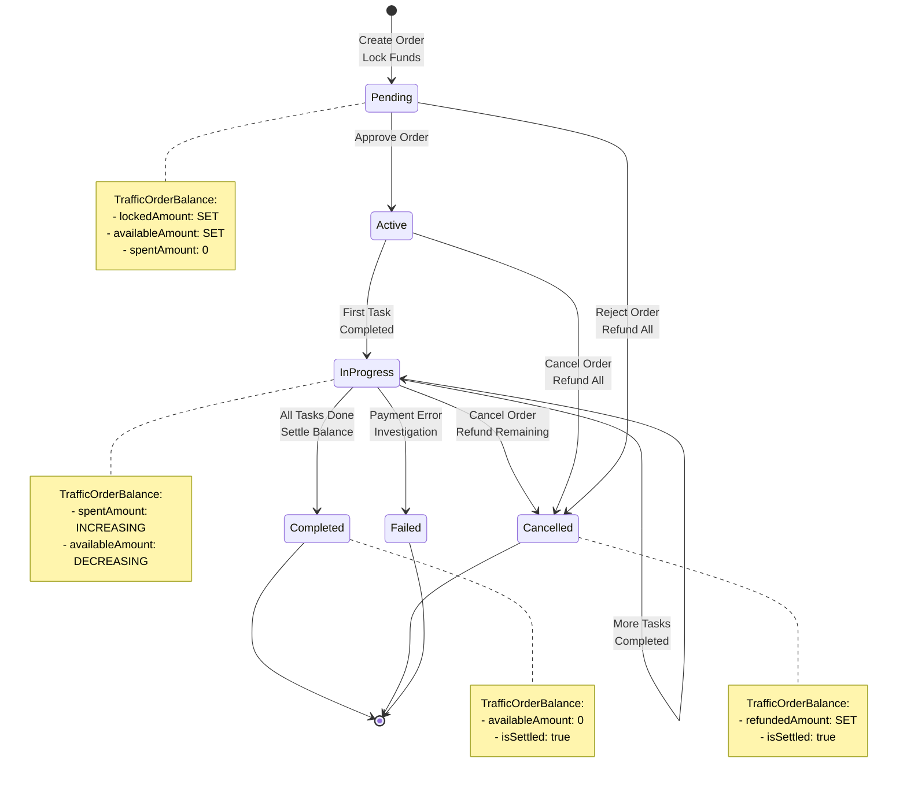
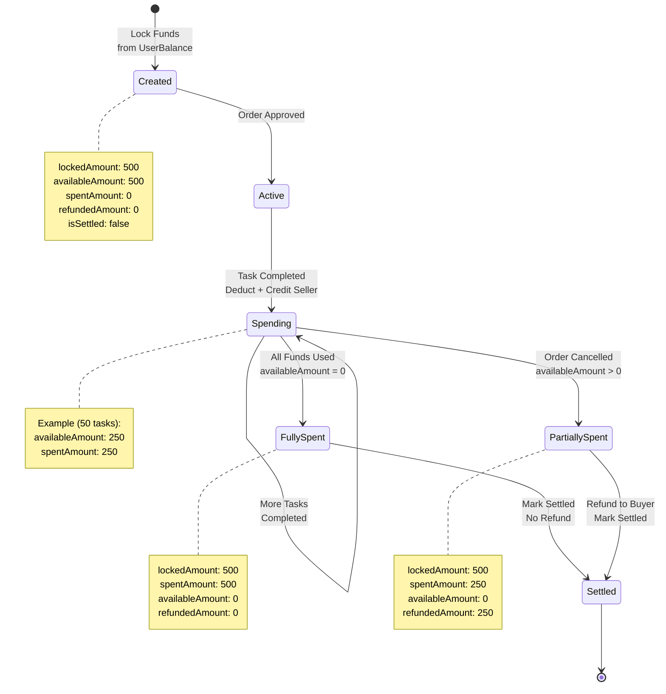
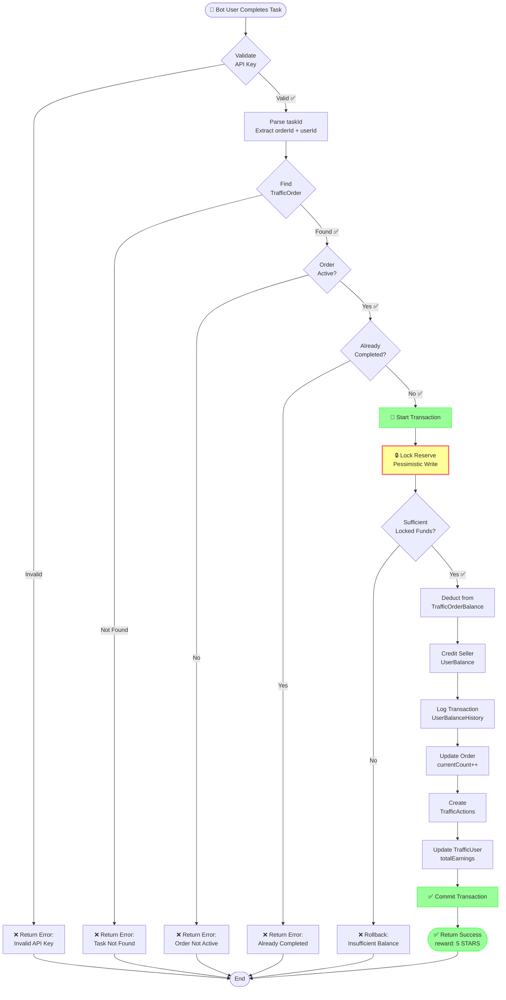
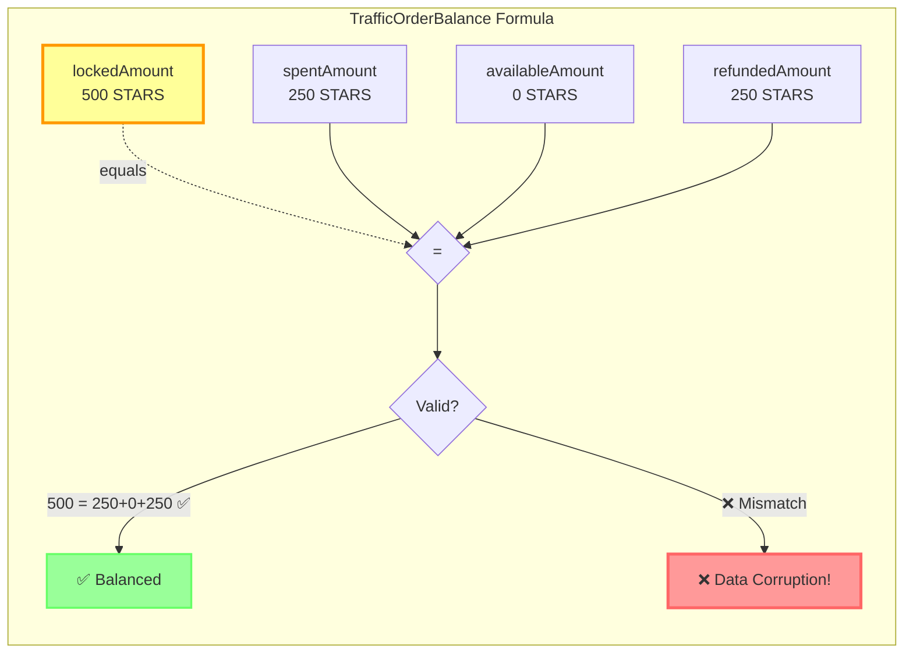

# Traffic & Balance System - Visual Diagrams

> These diagrams use Mermaid format and can be visualized in GitHub, VS Code, GitLab, and most modern documentation tools.

## 1. Entity Relationship Diagram (ERD)



## 2. Money Flow - Sequence Diagram

### Stage 1: Order Creation (Lock Funds)



### Stage 2: Task Completion (Pay Seller)



### Stage 3: Order Settlement (Refund)



## 3. Component Architecture



## 4. State Machine - TrafficOrder



## 5. State Machine - TrafficOrderBalance



## 6. Data Flow - Complete Task



## 7. Balance Formula Visualization



## 8. Actor Interaction Overview

```mermaid
graph TB
    subgraph "Buyer Side"
        Buyer[👤 Buyer<br/>Channel Owner]
        BuyerBal[💰 UserBalance<br/>Available Funds]
        Target[🎯 TrafficTarget<br/>Channel to Promote]
    end

    subgraph "Order Management"
        Order[📋 TrafficOrder<br/>100 tasks × 5 STARS]
        Reserve[🔒 TrafficOrderBalance<br/>500 STARS Locked]
    end

    subgraph "Seller Side"
        Seller[👨‍💼 Seller<br/>Bot Owner]
        Source[📱 TrafficSource<br/>Bot with Users]
        BotUsers[🤖🤖🤖 Bot Users<br/>Task Performers]
        SellerBal[💰 UserBalance<br/>Earnings]
    end

    Buyer -->|creates| Order
    Buyer -->|owns| Target
    Buyer -->|has| BuyerBal

    BuyerBal -.500 STARS.->|locks| Reserve

    Order -->|locks funds in| Reserve
    Order -->|connects to| Source
    Order -->|promotes| Target

    Seller -->|manages| Source
    Seller -->|has| SellerBal

    Source -->|has| BotUsers

    BotUsers -.complete tasks.-> Order

    Reserve -.pays.-> SellerBal
    Reserve -.refunds.-> BuyerBal

    style Reserve fill:#ff9,stroke:#f90,stroke-width:4px
    style Order fill:#9cf,stroke:#69f,stroke-width:2px
```

## How to View These Diagrams

### In GitHub
Just view this file on GitHub - Mermaid diagrams render automatically!

### In VS Code
1. Install extension: "Markdown Preview Mermaid Support"
2. Open this file
3. Press `Ctrl+Shift+V` (Windows/Linux) or `Cmd+Shift+V` (Mac)

### Online Viewers
- **Mermaid Live Editor**: https://mermaid.live/
- Copy any diagram code and paste to visualize

### In Documentation Sites
These diagrams work in:
- GitBook
- Docusaurus
- VuePress
- MkDocs (with plugin)
- Notion
- Confluence

## Export Options

You can export these diagrams as:
- **PNG/SVG**: Use Mermaid Live Editor
- **PDF**: Print from browser preview
- **Presentations**: Many tools support Mermaid (Slidev, Marp, reveal.js)
