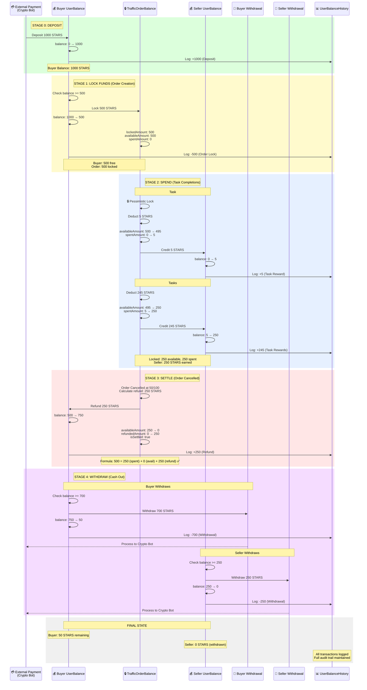
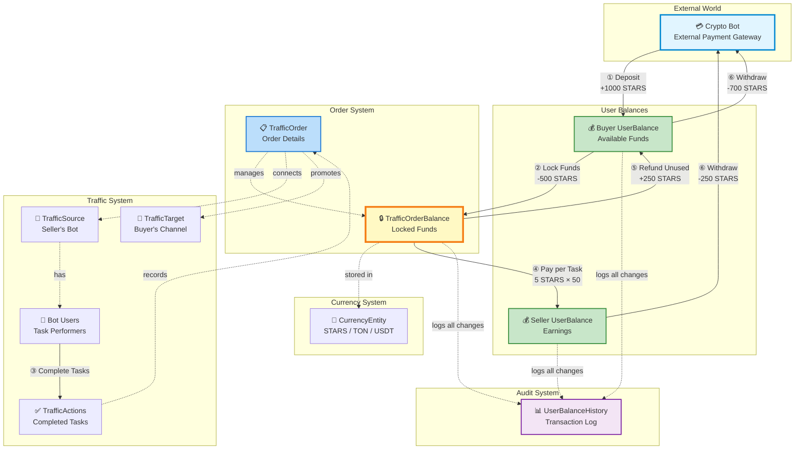
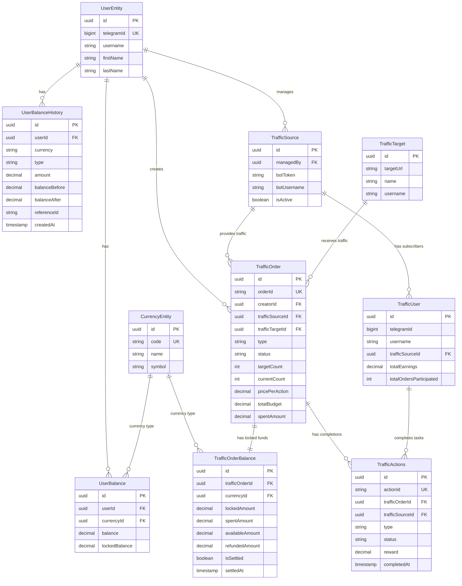
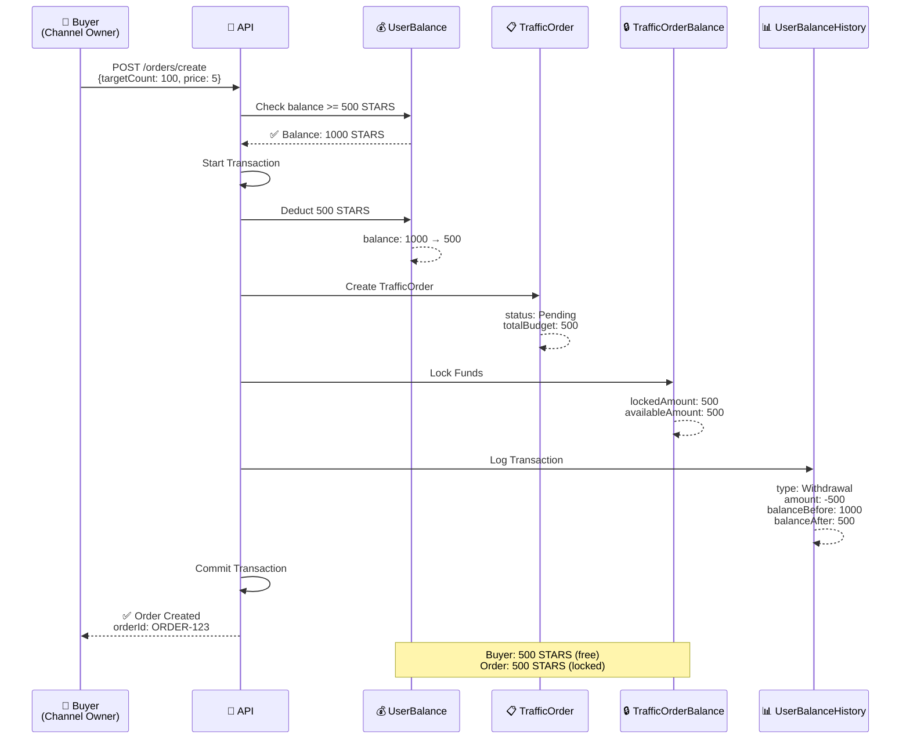
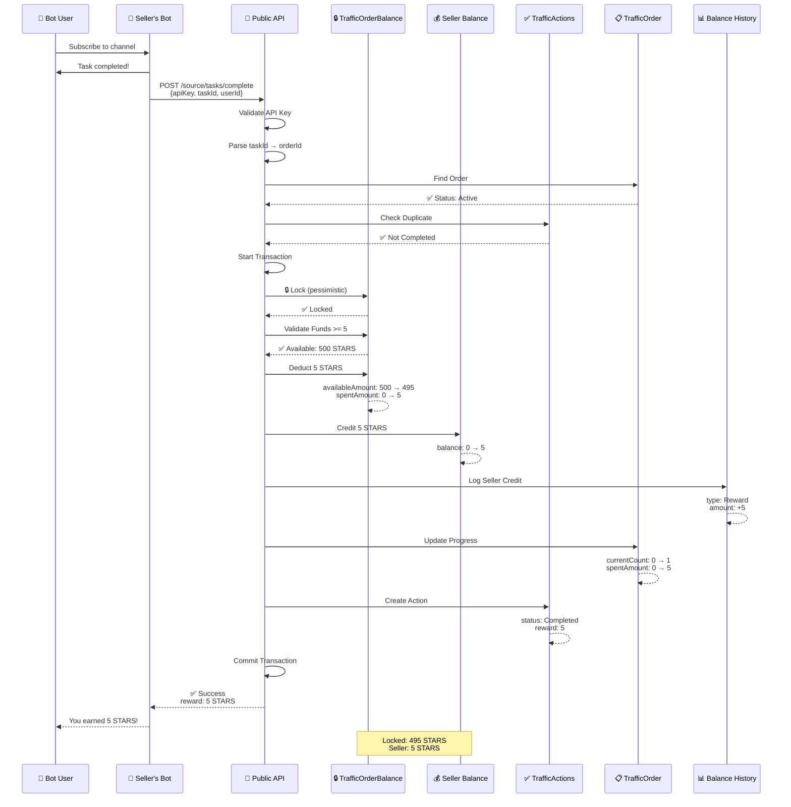
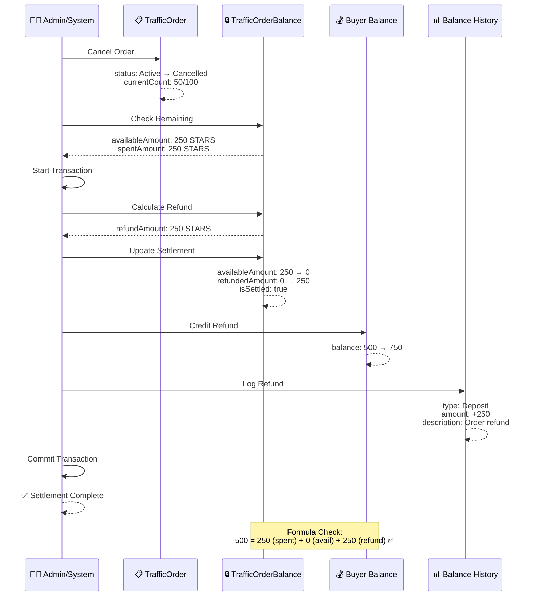
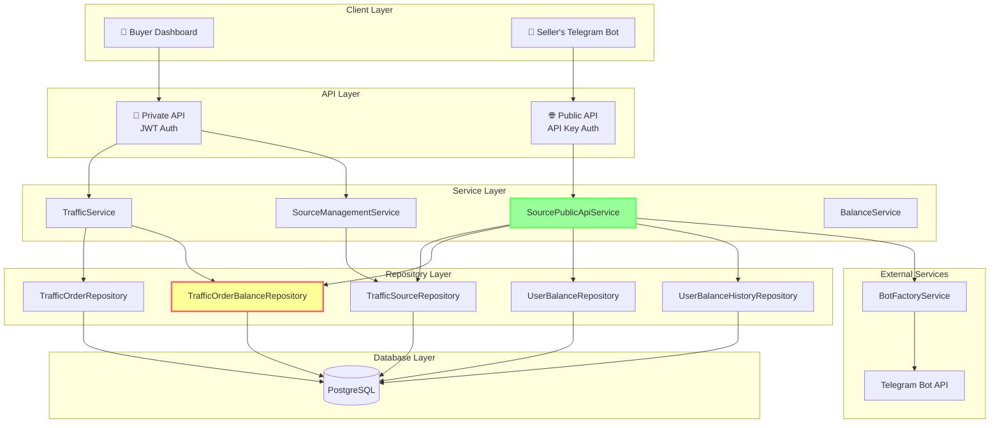
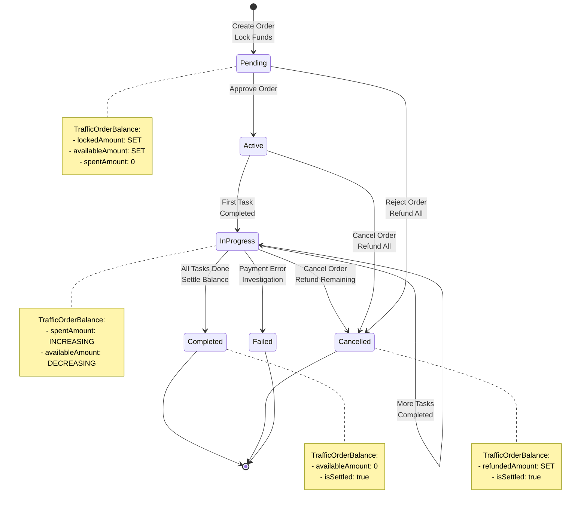
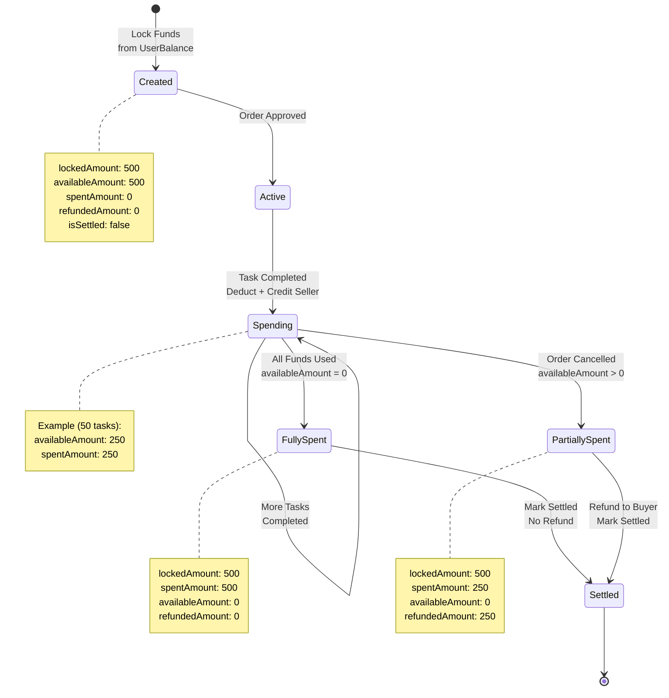
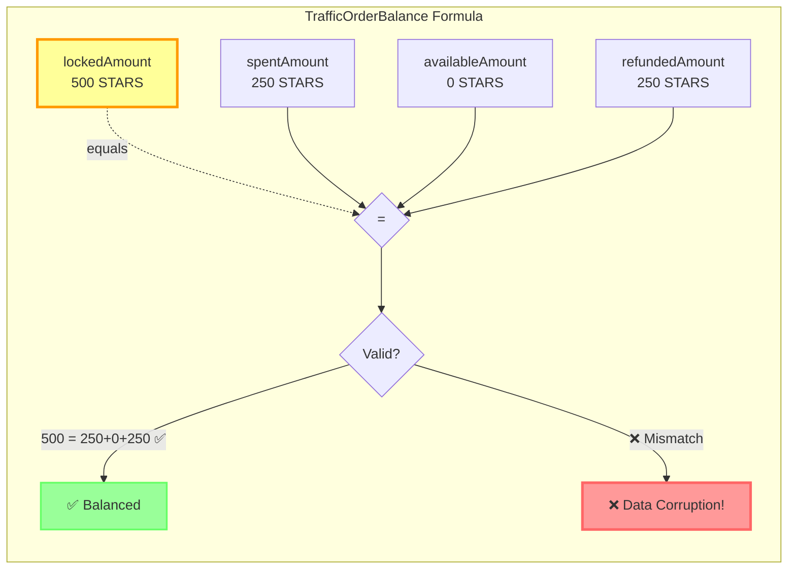

# Traffic & Balance System - Visual Diagrams

> These diagrams use Mermaid format and can be visualized in GitHub, VS Code, GitLab, and most modern documentation tools.

## 1. Complete Money Lifecycle Flow

### Full System Flow: Deposit → Lock → Spend → Settle → Withdraw

This comprehensive diagram shows the complete money flow through the entire system from initial deposit to final withdrawal.



### Money Flow Summary

| Stage | From | To | Amount | Balance Changes |
|-------|------|-----|--------|----------------|
| **0. Deposit** | External | Buyer UserBalance | +1000 STARS | Buyer: 0 → 1000 |
| **1. Lock** | Buyer UserBalance | TrafficOrderBalance | 500 STARS | Buyer: 1000 → 500<br/>Reserve: 0 → 500 (locked) |
| **2. Spend** | TrafficOrderBalance | Seller UserBalance | 250 STARS | Reserve: 500 → 250 (available)<br/>Seller: 0 → 250 |
| **3. Refund** | TrafficOrderBalance | Buyer UserBalance | 250 STARS | Reserve: 250 → 0 (settled)<br/>Buyer: 500 → 750 |
| **4. Withdraw** | Buyer UserBalance | External | 700 STARS | Buyer: 750 → 50 |
| **4. Withdraw** | Seller UserBalance | External | 250 STARS | Seller: 250 → 0 |

### Key Guarantees

1. **Atomic Transactions**: All balance updates wrapped in database transactions
2. **Pessimistic Locking**: TrafficOrderBalance locked during spend operations
3. **Balance Invariant**: `lockedAmount = spentAmount + availableAmount + refundedAmount`
4. **Audit Trail**: Every transaction logged in UserBalanceHistory
5. **No Negative Balances**: All deductions validate sufficient funds first

## 2. Complete Flow with All Entities

This diagram shows all entities and their interactions in the money flow.



### Flow Stages Explained

#### Stage 0: Deposit (External → UserBalance)
```
User deposits STARS via Crypto Bot payment gateway
→ UserBalance.balance increases
→ UserBalanceHistory records deposit
```

#### Stage 1: Lock (UserBalance → TrafficOrderBalance)
```
Buyer creates order with 500 STARS budget
→ UserBalance.balance decreases by 500
→ TrafficOrderBalance.lockedAmount = 500
→ TrafficOrderBalance.availableAmount = 500
→ UserBalanceHistory records lock transaction
```

#### Stage 2: Spend (TrafficOrderBalance → Seller UserBalance)
```
For each completed task (50 tasks × 5 STARS):
→ TrafficOrderBalance.availableAmount decreases by 5
→ TrafficOrderBalance.spentAmount increases by 5
→ Seller UserBalance.balance increases by 5
→ UserBalanceHistory records reward
→ TrafficActions records completion
```

#### Stage 3: Settle (TrafficOrderBalance → Buyer UserBalance)
```
Order cancelled after 50/100 tasks:
→ Remaining 250 STARS refunded to buyer
→ TrafficOrderBalance.availableAmount → 0
→ TrafficOrderBalance.refundedAmount = 250
→ TrafficOrderBalance.isSettled = true
→ Buyer UserBalance.balance increases by 250
→ UserBalanceHistory records refund
```

#### Stage 4: Withdraw (UserBalance → External)
```
Users withdraw their balances:
→ UserBalance.balance decreases
→ Crypto Bot processes payout
→ UserBalanceHistory records withdrawal
```

## 3. Entity Relationship Diagram (ERD)



## 4. Money Flow - Individual Stage Diagrams

### Stage 1: Order Creation (Lock Funds)



### Stage 2: Task Completion (Pay Seller)



### Stage 3: Order Settlement (Refund)



## 5. Component Architecture



## 6. State Machine - TrafficOrder



## 7. State Machine - TrafficOrderBalance



## 8. Data Flow - Complete Task


## 9. Balance Formula Visualization



## 10. Actor Interaction Overview

```mermaid
graph TB
    subgraph "Buyer Side"
        Buyer[👤 Buyer<br/>Channel Owner]
        BuyerBal[💰 UserBalance<br/>Available Funds]
        Target[🎯 TrafficTarget<br/>Channel to Promote]
    end

    subgraph "Order Management"
        Order[📋 TrafficOrder<br/>100 tasks × 5 STARS]
        Reserve[🔒 TrafficOrderBalance<br/>500 STARS Locked]
    end

    subgraph "Seller Side"
        Seller[👨‍💼 Seller<br/>Bot Owner]
        Source[📱 TrafficSource<br/>Bot with Users]
        BotUsers[🤖🤖🤖 Bot Users<br/>Task Performers]
        SellerBal[💰 UserBalance<br/>Earnings]
    end

    Buyer -->|creates| Order
    Buyer -->|owns| Target
    Buyer -->|has| BuyerBal

    BuyerBal -.500 STARS.->|locks| Reserve

    Order -->|locks funds in| Reserve
    Order -->|connects to| Source
    Order -->|promotes| Target

    Seller -->|manages| Source
    Seller -->|has| SellerBal

    Source -->|has| BotUsers

    BotUsers -.complete tasks.-> Order

    Reserve -.pays.-> SellerBal
    Reserve -.refunds.-> BuyerBal

    style Reserve fill:#ff9,stroke:#f90,stroke-width:4px
    style Order fill:#9cf,stroke:#69f,stroke-width:2px
```

## How to View These Diagrams

### In GitHub
Just view this file on GitHub - Mermaid diagrams render automatically!

### In VS Code
1. Install extension: "Markdown Preview Mermaid Support"
2. Open this file
3. Press `Ctrl+Shift+V` (Windows/Linux) or `Cmd+Shift+V` (Mac)

### Online Viewers
- **Mermaid Live Editor**: https://mermaid.live/
- Copy any diagram code and paste to visualize

### In Documentation Sites
These diagrams work in:
- GitBook
- Docusaurus
- VuePress
- MkDocs (with plugin)
- Notion
- Confluence

## Export Options

You can export these diagrams as:
- **PNG/SVG**: Use Mermaid Live Editor
- **PDF**: Print from browser preview
- **Presentations**: Many tools support Mermaid (Slidev, Marp, reveal.js)
