# Database Schema - MotivBuy Platform

## Entity Relationship Diagram

```mermaid
erDiagram
    %% Core User Management
    UserEntity {
        uuid id PK
        bigint telegram_id UK
        varchar username
        varchar first_name
        varchar last_name
        enum status "active|restricted|banned"
        enum role "user|admin|developer"
        varchar language_code
        uuid referred_by FK
        integer referral_count
        timestamptz created_at
        timestamptz updated_at
        timestamptz last_active_at
    }

    UserBalanceEntity {
        uuid id PK
        uuid user_id FK
        enum currency "RUB"
        decimal balance
        decimal locked_balance
        timestamptz created_at
        timestamptz updated_at
    }

    UserBalanceHistoryEntity {
        uuid id PK
        uuid user_id FK
        enum currency "RUB"
        enum type "deposit|withdrawal|transfer_in|transfer_out|reward|penalty|trade_buy|trade_sell|referral_bonus|admin_adjustment"
        enum status "pending|completed|failed|cancelled"
        decimal amount
        decimal balance_before
        decimal balance_after
        text description
        varchar tx_hash
        varchar reference_id
        json metadata
        timestamptz created_at
        timestamptz updated_at
    }

    UserSettingsEntity {
        uuid id PK
        uuid user_id FK
        varchar key
        text value
        enum type "boolean|string|number|json"
        text description
        boolean is_active
        timestamptz created_at
        timestamptz updated_at
    }

    UserRefLinkEntity {
        uuid id PK
        uuid user_id FK
        enum type "promo|user"
        varchar source_type
        uuid source_id
        varchar ref_code
        varchar ref_code_unique_key
        varchar default_unique_key
        decimal ref_percent_level_1
        decimal ref_percent_level_2
        decimal ref_percent_level_3
        boolean is_default
        boolean is_custom
        boolean is_deleted
        timestamptz created_at
        timestamptz updated_at
    }

    UserLastAuthEntity {
        uuid id PK
        uuid user_id FK
        inet ip
        varchar country
        varchar city
        varchar continent
        timestamptz created_at
        timestamptz updated_at
    }

    UserSourceVisitEntity {
        uuid id PK
        uuid user_id FK
        uuid link_user_id FK
        boolean is_signup
        enum platform_type
        json platform_data
        text params
        varchar utm_source
        varchar utm_medium
        varchar utm_campaign
        varchar utm_content
        varchar link_type
        varchar link_code
        varchar language
        varchar telegram_language
        varchar continent
        varchar country
        varchar city
        inet ip
        timestamptz created_at
    }

    %% Traffic Management
    TrafficSourceEntity {
        uuid id PK
        uuid managed_by_id FK
        varchar name
        text description
        enum type "bot|bot_with_token"
        text bot_token
        varchar bot_username
        bigint telegram_id
        boolean is_active
        json config
        timestamptz created_at
        timestamptz updated_at
    }

    TrafficTargetEntity {
        uuid id PK
        uuid managed_by_id FK
        varchar name
        text description
        enum type "channel|group|bot|with_checking"
        bigint telegram_id
        varchar username
        text invite_link
        boolean is_active
        boolean requires_approval
        decimal price_per_member
        integer min_members
        integer max_members
        json config
        timestamptz created_at
        timestamptz updated_at
    }

    TrafficUserEntity {
        uuid id PK
        uuid traffic_source_id FK
        bigint telegram_id UK
        varchar username
        varchar first_name
        varchar last_name
        integer total_orders_participated
        decimal total_earnings
        decimal completion_rate
        varchar language_code
        boolean is_bot
        boolean can_join_groups
        boolean can_receive_messages
        boolean supports_inline_queries
        enum status "active|inactive|banned|pending"
        timestamptz last_seen_at
        timestamptz joined_at
        timestamptz created_at
        timestamptz updated_at
    }

    %% Traffic Orders and Actions
    TrafficOrderEntity {
        uuid id PK
        varchar order_id UK
        uuid creator_id FK
        uuid traffic_source_id FK
        uuid traffic_target_id FK
        uuid assigned_traffic_user_id FK
        uuid created_by_id FK
        enum type "join|leave|view|subscribe|unsubscribe|react|comment"
        enum status "pending|active|completed|cancelled|failed|in_progress"
        integer target_count
        integer current_count
        decimal price_per_action
        decimal total_budget
        decimal spent_amount
        text description
        text target_url
        json requirements
        timestamptz start_date
        timestamptz end_date
        timestamptz completed_at
        timestamptz created_at
        timestamptz updated_at
    }

    TrafficActionsEntity {
        uuid id PK
        varchar action_id UK
        uuid traffic_order_id FK
        uuid traffic_source_id FK
        enum type "join|leave|view|subscribe|unsubscribe|react|comment|share|vote"
        enum status "pending|in_progress|completed|failed|cancelled"
        text description
        text target_url
        json action_data
        decimal reward
        timestamptz scheduled_at
        timestamptz started_at
        timestamptz completed_at
        timestamptz failed_at
        text failure_reason
        timestamptz created_at
        timestamptz updated_at
    }

    %% Categories
    TrafficSourceCategoryEntity {
        uuid id PK
        json name
        varchar slug UK
        enum category_type "All|Other|Blogs|News|Commerce|..."
        text description
        varchar color
        varchar icon
        integer sort_order
        boolean is_active
        json metadata
        timestamptz created_at
        timestamptz updated_at
    }

    %% Junction/Association Tables
    TrafficActionsUsersEntity {
        uuid id PK
        uuid traffic_action_id FK
        uuid traffic_user_id FK
        timestamptz participation_date
        boolean is_completed
        timestamptz completed_at
        decimal reward
        text notes
        timestamptz created_at
        timestamptz updated_at
    }

    TrafficTargetSourceEntity {
        uuid id PK
        uuid traffic_target_id FK
        uuid traffic_source_id FK
        boolean is_active
        json contract_terms
        decimal price_per_action
        integer minimum_order
        integer maximum_order
        timestamptz agreement_start_date
        timestamptz agreement_end_date
        timestamptz last_order_date
        integer total_orders_completed
        decimal total_amount_spent
        timestamptz created_at
        timestamptz updated_at
    }

    TrafficTargetUsersEntity {
        uuid id PK
        uuid traffic_target_id FK
        uuid traffic_user_id FK
        boolean can_view
        boolean can_contact
        boolean is_blocked
        timestamptz first_interaction_date
        timestamptz last_interaction_date
        integer total_interactions
        integer total_orders_shared
        text notes
        timestamptz created_at
        timestamptz updated_at
    }

    TrafficSourceCategoriesEntity {
        uuid id PK
        uuid traffic_source_id FK
        uuid category_id FK
        boolean is_primary
        integer sort_order
        json category_specific_config
        timestamptz created_at
        timestamptz updated_at
    }

    UserTrafficTargetEntity {
        uuid id PK
        uuid user_id FK
        uuid traffic_target_id FK
        enum role "manager|administrator|viewer|editor"
        boolean is_active
        json permissions
        timestamptz assigned_at
        uuid assigned_by_id FK
        timestamptz created_at
        timestamptz updated_at
    }

    UserTrafficOrderEntity {
        uuid id PK
        uuid user_id FK
        uuid traffic_order_id FK
        enum role "creator|reviewer|manager|viewer"
        boolean can_edit
        boolean can_view
        boolean can_approve
        timestamptz assigned_at
        uuid assigned_by_id FK
        timestamptz created_at
        timestamptz updated_at
    }

    UserTrafficSourceEntity {
        uuid id PK
        uuid user_id FK
        uuid traffic_source_id FK
        enum role "manager|administrator|moderator|operator"
        boolean is_active
        json permissions
        timestamptz assigned_at
        uuid assigned_by_id FK
        timestamptz created_at
        timestamptz updated_at
    }

    %% Core Relationships
    UserEntity ||--o{ UserBalanceEntity : "has balances"
    UserEntity ||--o{ UserBalanceHistoryEntity : "has transaction history"
    UserEntity ||--o{ UserSettingsEntity : "has settings"
    UserEntity ||--o{ UserRefLinkEntity : "has referral links"
    UserEntity ||--o| UserLastAuthEntity : "has last auth"
    UserEntity ||--o{ UserSourceVisitEntity : "has visits"
    UserEntity ||--o{ UserSourceVisitEntity : "referred visits"
    UserEntity ||--o{ TrafficSourceEntity : "manages sources"
    UserEntity ||--o{ TrafficTargetEntity : "manages targets"
    UserEntity ||--o{ TrafficOrderEntity : "creates orders"
    UserEntity ||--o{ TrafficOrderEntity : "created by"

    TrafficSourceEntity ||--o{ TrafficOrderEntity : "provides traffic"
    TrafficTargetEntity ||--o{ TrafficOrderEntity : "receives traffic"
    TrafficSourceEntity ||--o{ TrafficUserEntity : "has users"
    TrafficSourceEntity ||--o{ TrafficActionsEntity : "performs actions"

    TrafficUserEntity ||--o{ TrafficOrderEntity : "assigned to"
    TrafficOrderEntity ||--o{ TrafficActionsEntity : "contains actions"

    %% Junction Table Relationships
    TrafficActionsEntity ||--o{ TrafficActionsUsersEntity : "user assignments"
    TrafficUserEntity ||--o{ TrafficActionsUsersEntity : "action participations"

    TrafficTargetEntity ||--o{ TrafficTargetSourceEntity : "source contracts"
    TrafficSourceEntity ||--o{ TrafficTargetSourceEntity : "target contracts"

    TrafficTargetEntity ||--o{ TrafficTargetUsersEntity : "user relationships"
    TrafficUserEntity ||--o{ TrafficTargetUsersEntity : "target relationships"

    TrafficSourceEntity ||--o{ TrafficSourceCategoriesEntity : "category assignments"
    TrafficSourceCategoryEntity ||--o{ TrafficSourceCategoriesEntity : "source assignments"

    %% User Permission Relationships
    UserEntity ||--o{ UserTrafficTargetEntity : "target permissions"
    TrafficTargetEntity ||--o{ UserTrafficTargetEntity : "user permissions"
    UserEntity ||--o{ UserTrafficTargetEntity : "assigned permissions"

    UserEntity ||--o{ UserTrafficOrderEntity : "order permissions"
    TrafficOrderEntity ||--o{ UserTrafficOrderEntity : "user permissions"
    UserEntity ||--o{ UserTrafficOrderEntity : "assigned permissions"

    UserEntity ||--o{ UserTrafficSourceEntity : "source permissions"
    TrafficSourceEntity ||--o{ UserTrafficSourceEntity : "user permissions"
    UserEntity ||--o{ UserTrafficSourceEntity : "assigned permissions"

    %% Self-referencing relationship
    UserEntity ||--o{ UserEntity : "refers"
```



## Resource Ownership & Access Control

### Traffic Sources

- **Owner**: `managed_by_id` → UserEntity
- **Access**: User can only see statistics for traffic sources they manage
- **Related Data**: TrafficOrders, TrafficActions, TrafficUsers

### Traffic Targets

- **Owner**: `managed_by_id` → UserEntity
- **Access**: User can only see statistics for traffic targets they manage
- **Related Data**: TrafficOrders received, member counts, earnings

### Traffic Orders

- **Owner**: `creator_id` → UserEntity (who created the order)
- **Creator**: `created_by_id` → UserEntity (who submitted it to system)
- **Access**: Users can see orders they created or have permissions for
- **Related Data**: TrafficActions, spending, completion rates

### Users

- **Self**: Users can see their own statistics
- **Admin**: Admin users can see all user statistics
- **Related Data**: Balance history, referrals, order participation

## Query Optimization Guidelines

### Indexes Required

```sql
-- Traffic Sources
CREATE INDEX idx_traffic_sources_managed_by ON traffic_sources(managed_by_id);
CREATE INDEX idx_traffic_sources_active ON traffic_sources(is_active, managed_by_id);

-- Traffic Targets
CREATE INDEX idx_traffic_targets_managed_by ON traffic_targets(managed_by_id);
CREATE INDEX idx_traffic_targets_active ON traffic_targets(is_active, managed_by_id);

-- Traffic Orders
CREATE INDEX idx_traffic_orders_creator ON traffic_orders(creator_id);
CREATE INDEX idx_traffic_orders_source ON traffic_orders(traffic_source_id);
CREATE INDEX idx_traffic_orders_target ON traffic_orders(traffic_target_id);
CREATE INDEX idx_traffic_orders_date_range ON traffic_orders(created_at, creator_id);
CREATE INDEX idx_traffic_orders_status ON traffic_orders(status, creator_id);

-- User Balance History
CREATE INDEX idx_balance_history_user_date ON user_balance_history(user_id, created_at);
CREATE INDEX idx_balance_history_type ON user_balance_history(user_id, type);
```

### Aggregation Queries

Use PostgreSQL window functions and aggregations for performance:

- `COUNT()`, `SUM()`, `AVG()` at database level
- `date_trunc()` for time series grouping
- CTEs for complex multi-table statistics

### Resource Filtering Pattern

All statistics queries must include ownership filtering:

```typescript
// Traffic Source Stats - only sources managed by user
const sources = await repository.find({
  managed_by_id: userId,
  is_active: true,
  ...dateFilters,
});

// Traffic Order Stats - only orders created by user
const orders = await repository.find({
  creator_id: userId,
  ...statusFilters,
  ...dateFilters,
});
```

## Security Considerations

1. **Ownership Validation**: Every query must filter by resource ownership
2. **Permission Checks**: Use junction tables for shared resource access
3. **Data Isolation**: No cross-user data leakage
4. **Share Tokens**: Cryptographically secure with expiration
5. **Admin Access**: Separate admin endpoints for platform-wide statistics
